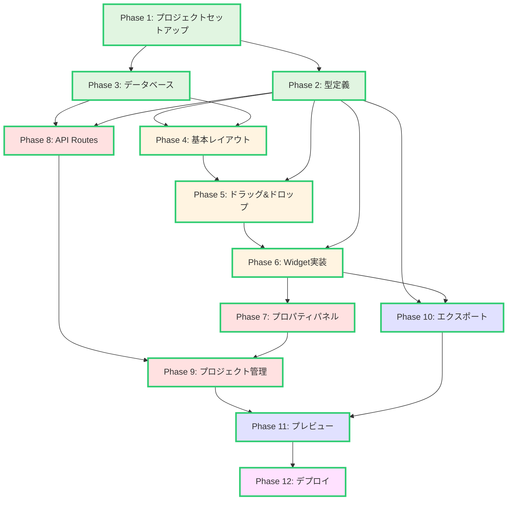
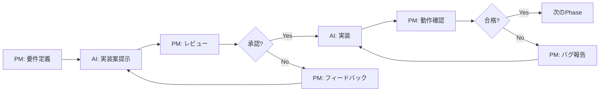
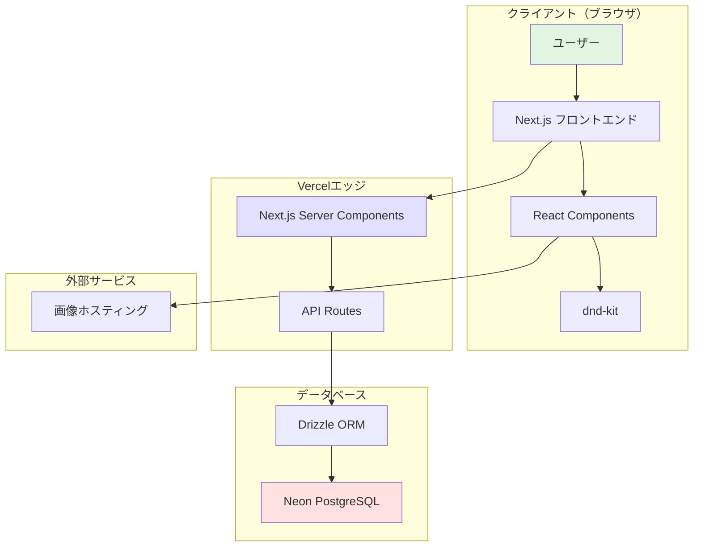
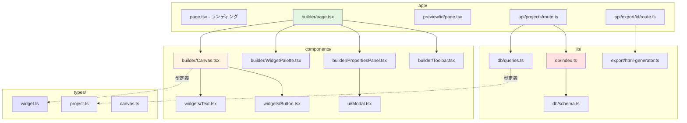
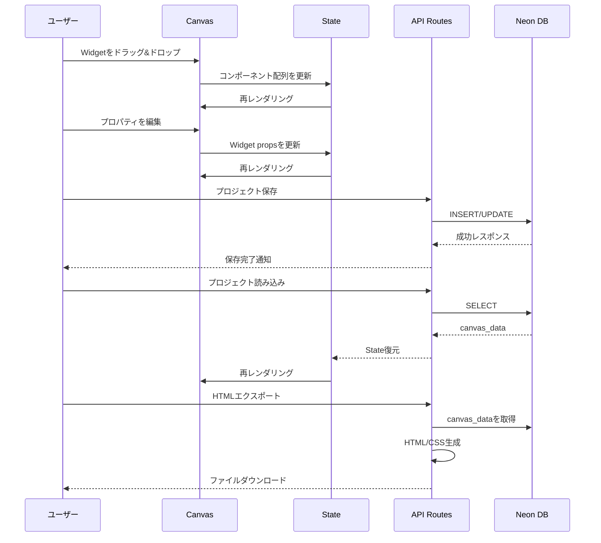
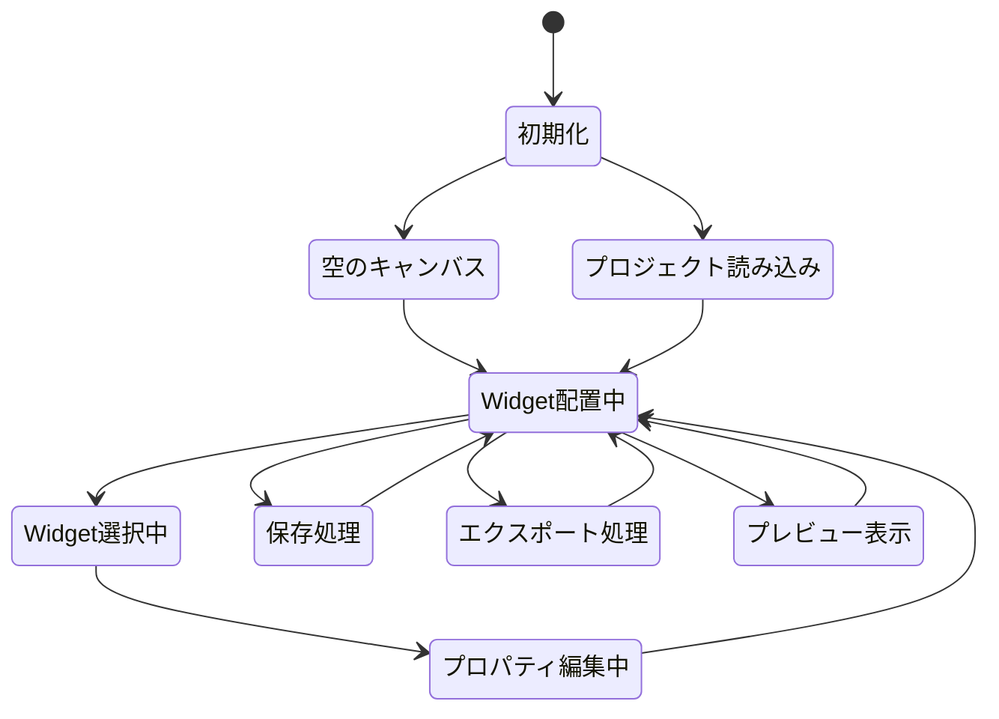

# NoCode UI Builder プロジェクト全体概要

**作成日**: 2025年10月21日
**ドキュメントバージョン**: 1.0
**対象者**: 開発者、プロジェクトマネージャー

---

## 目次

1. [プロジェクト概要](#プロジェクト概要)
2. [ビジョンと目的](#ビジョンと目的)
3. [開発方針と設計思想](#開発方針と設計思想)
4. [技術スタック詳細解説](#技術スタック詳細解説)
5. [全Phase一覧とフローチャート](#全phase一覧とフローチャート)
6. [開発スケジュール見積もり](#開発スケジュール見積もり)
7. [リスク管理マトリクス](#リスク管理マトリクス)
8. [チーム体制](#チーム体制)
9. [成功基準（KPI）](#成功基準kpi)
10. [アーキテクチャ図](#アーキテクチャ図)

---

## プロジェクト概要

### プロジェクト名
**NoCode UI Builder** - ノーコードUI構築プラットフォーム

### エグゼクティブサマリー

NoCode UI Builderは、プログラミング未経験者でも直感的にWebインターフェースを構築できるノーコード開発プラットフォームです。ドラッグ&ドロップ操作により、テキスト、入力フィールド、ボタン、画像、テーブル、セレクトボックスなど6種類の基本UIコンポーネントを配置し、プロパティをGUIで編集、最終的にHTML/CSSファイルとしてエクスポートできます。

本プロジェクトは、ノーコード開発の民主化を目指し、一般ユーザーがWeb開発の基礎を体験できる学習用プロトタイプとして開発されます。

### プロジェクトの背景

近年、Webflow、Bubble、Adaloなどのノーコードプラットフォームが急速に普及しています。しかし、これらの商用ツールは多機能であるがゆえに学習コストが高く、初心者が気軽に試すには敷居が高い現状があります。

本プロジェクトは、以下の課題を解決します:
- **学習用途**: ノーコード開発の基本概念を理解するための教育ツール
- **プロトタイピング**: 簡易的なランディングページやUIモックアップの迅速な作成
- **無料アクセス**: インターネット上で誰でもアクセス可能な公開プラットフォーム

---

## ビジョンと目的

### ビジョン

> 「誰もがWebデザイナーになれる世界を創る」
>
> プログラミングスキルがなくても、アイデアを視覚化し、インタラクティブなWebページを作成できる環境を提供します。

### プロジェクトの目的

1. **教育的価値の提供**
   - ノーコード開発の基本原理を体験的に学習
   - UI/UXデザインの基礎理解の促進
   - Web技術（HTML/CSS）の出力を通じた技術理解

2. **アクセシビリティの向上**
   - 無料で誰でも利用可能
   - 認証不要（初期バージョン）でブラウザからすぐに開始
   - シンプルで直感的なUI/UX

3. **技術的実証**
   - Next.js 14の最新機能（App Router、Server Components）の活用
   - dnd-kitによる高度なドラッグ&ドロップ実装
   - Neon PostgreSQLのサーバーレスデータベース活用

### ターゲットユーザー

| ユーザー層 | ニーズ | 利用シーン |
|-----------|--------|-----------|
| **プログラミング初心者** | コーディング不要でWebページを作成したい | 個人ブログ、ポートフォリオサイトの作成 |
| **デザイナー** | デザインモックアップを実際のHTMLとして出力したい | クライアントプレゼン用プロトタイプ |
| **教育者** | 学生にノーコード開発を教えたい | プログラミング入門講座の教材 |
| **スタートアップ創業者** | MVPのランディングページを迅速に作成したい | 初期プロダクトのマーケティングサイト |

---

## 開発方針と設計思想

### コア原則

#### 1. シンプルさの追求（KISS原則）
- **最小限の機能**: 必要十分な6種類のWidgetのみ実装
- **直感的操作**: 説明不要のドラッグ&ドロップUI
- **クリーンコード**: TypeScriptによる型安全性と可読性の確保

#### 2. 拡張性の確保
- **モジュラー設計**: 各Widgetは独立したコンポーネント
- **プラグイン対応準備**: 将来的なWidget追加を想定したアーキテクチャ
- **API設計**: RESTful APIによる疎結合

#### 3. パフォーマンス優先
- **React Server Components**: 初回レンダリングの高速化
- **静的最適化**: Tailwind CSSのPurge機能
- **遅延読み込み**: 必要なコンポーネントのみ動的インポート

#### 4. ユーザーエクスペリエンス
- **リアルタイムプレビュー**: 変更が即座に反映
- **アンドゥ/リドゥ（将来実装）**: 操作の取り消し機能
- **レスポンシブ対応（将来実装）**: マルチデバイス対応

### 技術的制約と意図的な省略

本プロトタイプでは、以下の機能を**意図的にスコープ外**としています:

| 省略機能 | 理由 | 将来の拡張可能性 |
|---------|------|----------------|
| ユーザー認証 | 開発工数削減、誰でもアクセス可能にするため | Phase 7以降で追加検討 |
| レスポンシブデザイン編集 | 複雑性を避け、基本機能に集中 | Phase 8で追加 |
| JavaScript動作のエクスポート | 静的HTML/CSSに限定 | Phase 9で検討 |
| データバインディング | プロトタイプの範囲を超える | Phase 10で検討 |
| コラボレーション機能 | リアルタイム同期の複雑性 | Phase 11で検討 |
| バージョン管理 | Git統合の複雑性 | Phase 12で検討 |

---

## 技術スタック詳細解説

### フロントエンド技術

#### Next.js 14（App Router）

**選定理由:**
- **Server Components**: 初回ロードの高速化、SEO最適化
- **File-based Routing**: 直感的なルーティング設定
- **API Routes統合**: フロントエンドとバックエンドの統一環境
- **Vercel最適化**: デプロイの簡素化

**主要機能の活用:**
```typescript
// app/builder/page.tsx (Server Component)
export default async function BuilderPage() {
  // サーバーサイドでの初期データ取得
  const projects = await fetchProjects();
  return <BuilderClient initialProjects={projects} />;
}

// app/builder/BuilderClient.tsx (Client Component)
'use client';
export function BuilderClient({ initialProjects }) {
  // クライアントサイドのインタラクティブな操作
  const [components, setComponents] = useState([]);
  // ...
}
```

#### TypeScript 5+

**選定理由:**
- **型安全性**: コンパイル時のエラー検出
- **開発者体験**: IntelliSenseによる補完
- **リファクタリング容易性**: 型情報による安全な変更

**型システム設計方針:**
```typescript
// 厳格な型定義によるバグ防止
interface Widget {
  id: string;
  type: WidgetType; // Union型による制限
  position: Position; // 構造化された座標
  size: Size; // 構造化されたサイズ
  props: WidgetProps; // Widget種類別のプロパティ
}

// Type Guardsによる安全な型ナローイング
function isButtonWidget(widget: Widget): widget is ButtonWidget {
  return widget.type === 'Button';
}
```

#### Tailwind CSS 3+

**選定理由:**
- **高速開発**: ユーティリティクラスによる迅速なスタイリング
- **一貫性**: デザインシステムの統一
- **バンドルサイズ最適化**: 使用されたクラスのみ出力
- **カスタマイズ性**: tailwind.config.tsでの柔軟な設定

**カスタム設定例:**
```typescript
// tailwind.config.ts
export default {
  theme: {
    extend: {
      colors: {
        primary: {
          50: '#eff6ff',
          100: '#dbeafe',
          // ... 省略
          900: '#1e3a8a',
        },
      },
      spacing: {
        128: '32rem',
        144: '36rem',
      },
    },
  },
};
```

#### dnd-kit

**選定理由:**
- **アクセシビリティ**: キーボード操作、スクリーンリーダー対応
- **パフォーマンス**: 仮想化によるスムーズな動作
- **柔軟性**: カスタムドラッグ&ドロップロジック
- **タッチデバイス対応**: モバイル・タブレット対応

**実装パターン:**
```typescript
import { DndContext, useDraggable, useDroppable } from '@dnd-kit/core';

function Canvas() {
  const { setNodeRef } = useDroppable({ id: 'canvas' });

  function handleDragEnd(event: DragEndEvent) {
    const { active, over } = event;
    if (over?.id === 'canvas') {
      // キャンバスにWidgetを追加
      addWidget(active.data.current.type);
    }
  }

  return (
    <DndContext onDragEnd={handleDragEnd}>
      <div ref={setNodeRef}>{/* Canvas content */}</div>
    </DndContext>
  );
}
```

### バックエンド・データベース技術

#### Drizzle ORM

**選定理由:**
- **型安全性**: TypeScriptとの完全統合
- **軽量**: Prismaより小さいバンドルサイズ
- **柔軟性**: 生SQLに近い記述
- **マイグレーション**: シンプルなスキーマ管理

**スキーマ定義例:**
```typescript
// lib/db/schema.ts
import { pgTable, serial, text, timestamp, json } from 'drizzle-orm/pg-core';

export const projects = pgTable('projects', {
  id: serial('id').primaryKey(),
  name: text('name').notNull(),
  description: text('description'),
  canvasData: json('canvas_data').notNull(),
  createdAt: timestamp('created_at').defaultNow(),
  updatedAt: timestamp('updated_at').defaultNow(),
});
```

#### Neon PostgreSQL

**選定理由:**
- **サーバーレス**: 使用量に応じた自動スケーリング
- **無料枠**: 0.5GBストレージ、十分な開発・プロトタイプ用途
- **低レイテンシ**: エッジネットワーク対応
- **開発者体験**: 簡単なセットアップ、Web UI

**接続設定:**
```typescript
// lib/db/index.ts
import { neon } from '@neondatabase/serverless';
import { drizzle } from 'drizzle-orm/neon-http';

const sql = neon(process.env.DATABASE_URL!);
export const db = drizzle(sql);
```

### デプロイ・インフラ

#### Vercel

**選定理由:**
- **Next.js最適化**: 開発元による完全サポート
- **自動CI/CD**: GitHubプッシュで自動デプロイ
- **エッジネットワーク**: グローバルCDN
- **無料枠**: 個人プロジェクトに十分

**デプロイ設定:**
```json
// vercel.json
{
  "buildCommand": "npm run build",
  "devCommand": "npm run dev",
  "installCommand": "npm install",
  "env": {
    "DATABASE_URL": "@database-url"
  }
}
```

---

## 全Phase一覧とフローチャート

### Phase概要

プロジェクトは12のPhaseに分割され、段階的に機能を実装します。Phase 1-6が**MVP（Minimum Viable Product）**として最優先で開発され、Phase 7-12は将来的な拡張として位置づけられます。

### Phase詳細

#### Phase 1: プロジェクトセットアップ（時間見積: 30-45分）

**目的:** 開発環境の構築とベース設定

**タスク:**
1. Next.js 14プロジェクト初期化（`create-next-app`）
2. TypeScript設定（`tsconfig.json`）
3. Tailwind CSS設定（`tailwind.config.ts`、`postcss.config.js`）
4. 依存パッケージインストール（dnd-kit、Drizzle ORM等）
5. ディレクトリ構造作成
6. Git初期化とリモートリポジトリ設定
7. ESLint/Prettier設定

**成果物:**
- 動作するNext.js開発サーバー
- 全設定ファイルの完成
- Git履歴の初期化

**チェックリスト:**
- [ ] `npm run dev`で開発サーバー起動
- [ ] TypeScript型チェック成功
- [ ] Tailwind CSSクラスが適用される
- [ ] ESLint警告なし

**詳細ドキュメント:** `20251021_01-project-setup.md`

---

#### Phase 2: 型定義とユーティリティ（時間見積: 45-60分）

**目的:** TypeScript型システムの構築と共通ユーティリティ関数の実装

**タスク:**
1. Widget型定義（`types/widget.ts`）
   - BaseWidget、各Widget型（Text、Input、Button等）
   - Props型定義
   - Union型とType Guards
2. Project型定義（`types/project.ts`）
3. Canvas型定義（`types/canvas.ts`）
4. ユーティリティ関数（`lib/utils.ts`）
   - `cn()`関数（clsx + tailwind-merge）
   - UUID生成
   - 座標計算ヘルパー

**成果物:**
- 完全な型定義ファイル
- 型安全なユーティリティ関数

**チェックリスト:**
- [ ] 型エラーなしでコンパイル
- [ ] すべてのWidget型が定義済み
- [ ] Type Guardsのテスト成功

**詳細ドキュメント:** `20251021_02-type-definitions.md`

---

#### Phase 3: データベースセットアップ（時間見積: 30-45分）

**目的:** Neon PostgreSQLとDrizzle ORMの設定

**タスク:**
1. Neonアカウント作成とデータベース作成
2. 接続文字列取得と`.env.local`設定
3. Drizzle ORMスキーマ定義（`lib/db/schema.ts`）
4. Drizzle設定ファイル（`drizzle.config.ts`）
5. マイグレーション実行
6. データベースクエリ関数（`lib/db/queries.ts`）

**成果物:**
- 動作するデータベース接続
- projectsテーブル

**チェックリスト:**
- [ ] データベース接続成功
- [ ] テーブル作成完了
- [ ] CRUD操作のテスト成功

---

#### Phase 4: 基本レイアウトとUI（時間見積: 60-90分）

**目的:** ビルダー画面の基本レイアウト構築

**タスク:**
1. ランディングページ（`app/page.tsx`）
2. ビルダーページレイアウト（`app/builder/page.tsx`）
3. Toolbar コンポーネント
4. Widget Palette コンポーネント
5. Canvas コンポーネント（空の状態）
6. Properties Panel コンポーネント（空の状態）
7. 共通UIコンポーネント（Modal、Toast、Spinner）

**成果物:**
- 3カラムレイアウトのビルダー画面
- レスポンシブ対応の基本UI

**チェックリスト:**
- [ ] レイアウトが正しく表示
- [ ] 各セクションの配置が適切
- [ ] モバイルでの表示確認

---

#### Phase 5: ドラッグ&ドロップ実装（時間見積: 90-120分）

**目的:** dnd-kitによるドラッグ&ドロップ機能の実装

**タスク:**
1. DndContext設定
2. Widget Paletteからのドラッグ実装
3. Canvasへのドロップ実装
4. Canvas内のWidget移動実装
5. ドラッグプレビュー表示
6. スナップグリッド機能
7. 衝突検出

**成果物:**
- 完全なドラッグ&ドロップ機能
- スムーズなアニメーション

**チェックリスト:**
- [ ] Paletteからドラッグ可能
- [ ] Canvasにドロップ可能
- [ ] Widget移動可能
- [ ] グリッドスナップ動作

---

#### Phase 6: Widget実装（時間見積: 90-120分）

**目的:** 6種類のWidgetコンポーネントの完全実装

**タスク:**
1. TextWidget実装（`components/widgets/Text.tsx`）
2. InputWidget実装（`components/widgets/Input.tsx`）
3. ButtonWidget実装（`components/widgets/Button.tsx`）
4. ImageWidget実装（`components/widgets/Image.tsx`）
5. TableWidget実装（`components/widgets/Table.tsx`）
6. SelectWidget実装（`components/widgets/Select.tsx`）
7. WidgetWrapper実装（選択状態、リサイズハンドル）

**成果物:**
- 6つの完全なWidgetコンポーネント
- プレビュー表示

**チェックリスト:**
- [ ] すべてのWidgetが正しくレンダリング
- [ ] デフォルト値が適用
- [ ] スタイルが正しく適用

---

#### Phase 7: プロパティパネル実装（時間見積: 60-90分）

**目的:** Widget別のプロパティ編集UI

**タスク:**
1. Widget選択ロジック
2. Widget別プロパティフォーム
   - Text: content、fontSize、color等
   - Input: label、placeholder等
   - Button: text、variant、size等
   - Image: src、alt、objectFit等
   - Table: columns、data編集
   - Select: options編集
3. リアルタイムプレビュー更新
4. プロパティバリデーション

**成果物:**
- 動的プロパティパネル
- リアルタイム更新

**チェックリスト:**
- [ ] Widgetクリックで選択
- [ ] プロパティ変更が即座に反映
- [ ] バリデーションエラー表示

---

#### Phase 8: API Routes実装（時間見積: 45-60分）

**目的:** プロジェクトの保存・読み込みAPI

**タスク:**
1. `GET /api/projects` - プロジェクト一覧
2. `POST /api/projects` - プロジェクト作成
3. `GET /api/projects/[id]` - プロジェクト詳細
4. `PUT /api/projects/[id]` - プロジェクト更新
5. `DELETE /api/projects/[id]` - プロジェクト削除
6. エラーハンドリング
7. バリデーション

**成果物:**
- RESTful API
- データベース連携

**チェックリスト:**
- [ ] すべてのエンドポイントが動作
- [ ] エラーが適切に処理
- [ ] データが正しく永続化

---

#### Phase 9: プロジェクト管理機能（時間見積: 45-60分）

**目的:** プロジェクト保存・読み込みのUI実装

**タスク:**
1. 保存ボタン実装
2. 保存ダイアログ（名前、説明入力）
3. プロジェクト読み込みダイアログ
4. プロジェクト一覧表示
5. 削除確認ダイアログ
6. 自動保存機能（オプション）

**成果物:**
- 完全なプロジェクト管理UI
- ユーザーフィードバック

**チェックリスト:**
- [ ] プロジェクト保存可能
- [ ] 保存したプロジェクトを読み込み可能
- [ ] プロジェクト削除可能
- [ ] Toast通知が表示

---

#### Phase 10: HTML/CSSエクスポート実装（時間見積: 60-90分）

**目的:** Canvas内容をHTML/CSSファイルとして出力

**タスク:**
1. HTML生成ロジック（`lib/export/html-generator.ts`）
   - Widget → HTMLタグ変換
   - スタイルのインライン化
   - レスポンシブメタタグ
2. CSS生成ロジック
   - Tailwindクラス → CSS変換
   - カスタムスタイル埋め込み
3. エクスポートAPI（`GET /api/export/[id]`）
4. ダウンロードボタンUI
5. ZIPファイル生成（HTML + CSS分離オプション）

**成果物:**
- HTML/CSSエクスポート機能
- ダウンロード可能なファイル

**チェックリスト:**
- [ ] HTMLファイル生成成功
- [ ] スタイルが正しく適用
- [ ] ブラウザで開いて表示確認
- [ ] ダウンロード可能

---

#### Phase 11: プレビュー機能（時間見積: 30-45分）

**目的:** 実際のWebページとしてのプレビュー表示

**タスク:**
1. プレビューページ（`app/preview/[id]/page.tsx`）
2. フルスクリーンプレビュー
3. デバイス切り替え（Desktop/Tablet/Mobile）
4. 編集モードとの切り替え

**成果物:**
- プレビューモード
- デバイスシミュレーション

**チェックリスト:**
- [ ] プレビューが正しく表示
- [ ] デバイス切り替え動作
- [ ] 編集モードに戻れる

---

#### Phase 12: 最終調整とデプロイ（時間見積: 45-60分）

**目的:** バグフィックス、UI/UX改善、本番デプロイ

**タスク:**
1. エッジケーステスト
2. UI/UXポリッシュ
   - ローディング状態
   - エラーメッセージ改善
   - アクセシビリティ対応
3. パフォーマンス最適化
   - 画像最適化
   - バンドルサイズ削減
4. Vercelデプロイ設定
5. 環境変数設定
6. 本番デプロイ
7. 動作確認

**成果物:**
- 本番環境で動作するアプリケーション
- 公開URL

**チェックリスト:**
- [ ] すべての機能が動作
- [ ] エラーなし
- [ ] パフォーマンステスト合格
- [ ] 本番環境でアクセス可能

---

### Phase間の依存関係フローチャート



**凡例:**
- 緑色: セットアップ系（Phase 1-3）
- 黄色: UI基盤（Phase 4-6）
- 赤色: 機能実装（Phase 7-9）
- 青色: エクスポート系（Phase 10-11）
- 紫色: デプロイ（Phase 12）

---

## 開発スケジュール見積もり

### 総見積時間: 4.5 - 7時間

### タスクブレイクダウン（累計時間）

| Phase | タスク | 最小時間 | 最大時間 | 累計（最大） |
|-------|--------|---------|---------|------------|
| **Phase 1** | プロジェクトセットアップ | 30分 | 45分 | 0:45 |
| **Phase 2** | 型定義 | 45分 | 60分 | 1:45 |
| **Phase 3** | データベース | 30分 | 45分 | 2:30 |
| **Phase 4** | 基本レイアウト | 60分 | 90分 | 4:00 |
| **Phase 5** | ドラッグ&ドロップ | 90分 | 120分 | 6:00 |
| **Phase 6** | Widget実装 | 90分 | 120分 | 8:00 |
| **Phase 7** | プロパティパネル | 60分 | 90分 | 9:30 |
| **Phase 8** | API Routes | 45分 | 60分 | 10:30 |
| **Phase 9** | プロジェクト管理 | 45分 | 60分 | 11:30 |
| **Phase 10** | エクスポート | 60分 | 90分 | 13:00 |
| **Phase 11** | プレビュー | 30分 | 45分 | 13:45 |
| **Phase 12** | 最終調整・デプロイ | 45分 | 60分 | **14:45** |

### 開発モデル: アジャイルスプリント

**スプリント構成:**
- **Sprint 1（2-3時間）**: Phase 1-3（基盤構築）
- **Sprint 2（3-4時間）**: Phase 4-6（UI実装）
- **Sprint 3（2-3時間）**: Phase 7-9（機能実装）
- **Sprint 4（2-3時間）**: Phase 10-12（エクスポート・デプロイ）

**デイリーチェックポイント:**
- 毎日の終了時に動作確認
- Gitコミット（意味のある単位）
- 次の日の作業計画立案

### バッファ時間

予期しない問題に備えて、総見積時間の20%（約3時間）をバッファとして確保:

**合計開発時間: 14.75時間 + 3時間バッファ = 約18時間**

**実稼働日数見積:**
- **集中開発**: 2-3日（1日6時間作業）
- **通常ペース**: 4-5日（1日3-4時間作業）

---

## リスク管理マトリクス

### リスク評価基準

**影響度:**
- 高: プロジェクト完成に致命的
- 中: 機能制限が発生
- 低: 軽微な影響

**発生確率:**
- 高: 50%以上
- 中: 20-50%
- 低: 20%未満

### リスク一覧

| ID | リスク項目 | 影響度 | 確率 | リスクレベル | 軽減策 | 対応策 |
|----|-----------|-------|------|------------|--------|--------|
| R1 | Neon無料枠の制限超過 | 中 | 低 | 低 | データ量監視、最適化 | 有料プランへのアップグレード |
| R2 | dnd-kitの学習曲線 | 中 | 中 | 中 | 公式ドキュメント精読、サンプルコード参照 | react-beautiful-dndへの切り替え検討 |
| R3 | TypeScript型エラー | 低 | 中 | 低 | 段階的な型定義、厳格モード無効化（初期） | anyの一時使用、後で修正 |
| R4 | パフォーマンス問題 | 中 | 中 | 中 | React.memoの使用、仮想化 | パフォーマンスプロファイリング |
| R5 | ブラウザ互換性 | 低 | 低 | 低 | モダンブラウザのみサポート明記 | Polyfillの追加 |
| R6 | Vercelデプロイエラー | 高 | 低 | 中 | ローカルで`npm run build`テスト | ビルドログ確認、環境変数確認 |
| R7 | セキュリティ脆弱性（XSS等） | 高 | 中 | 高 | サニタイゼーション実装 | セキュリティ監査、ライブラリ更新 |
| R8 | スコープクリープ | 中 | 高 | 高 | 厳格なPhase管理 | Phase 7以降を後回し |

### 高リスク項目への対応

#### R7: セキュリティ脆弱性

**具体的対策:**
```typescript
// HTMLエクスポート時のサニタイゼーション
import DOMPurify from 'isomorphic-dompurify';

function sanitizeHTML(html: string): string {
  return DOMPurify.sanitize(html, {
    ALLOWED_TAGS: ['div', 'span', 'p', 'button', 'input', 'img', 'table', 'tr', 'td', 'th', 'select', 'option'],
    ALLOWED_ATTR: ['class', 'style', 'src', 'alt', 'type', 'placeholder', 'value'],
  });
}
```

#### R8: スコープクリープ

**防止策:**
- Phase 1-12の厳格な定義
- 新機能要望は「将来の拡張」リストに追加
- MVP完成を最優先

---

## チーム体制

### プロジェクト構成

本プロジェクトは、**1名のプロジェクトマネージャー（PM）+ AIエージェント**による開発体制です。

### 役割定義

#### プロジェクトマネージャー（あなた）

**責任範囲:**
- プロジェクト全体の意思決定
- Phase進行の管理
- 最終的なコード品質の確認
- デザイン判断
- デプロイ実行

**作業内容:**
- ドキュメント確認
- コード レビュー
- バグテスト
- UI/UX検証

#### AIエージェント（Claude）

**責任範囲:**
- コード実装
- ドキュメント作成
- 技術調査
- ベストプラクティス提案

**作業内容:**
- TypeScriptコードの生成
- 設定ファイルの作成
- バグ修正の提案
- パフォーマンス最適化の提案

### コミュニケーションフロー



### 開発ワークフロー

1. **Phase開始**
   - PMがPhaseドキュメント確認
   - AIに実装指示

2. **実装**
   - AIがコード生成
   - PMがリアルタイムレビュー

3. **テスト**
   - PMが動作確認
   - バグがあればAIに修正依頼

4. **完了**
   - Gitコミット
   - 次のPhaseへ

---

## 成功基準（KPI）

### 技術的KPI

| 指標 | 目標値 | 測定方法 |
|------|--------|---------|
| **ビルド成功率** | 100% | `npm run build`の成功 |
| **TypeScript型エラー** | 0件 | `npm run type-check` |
| **ESLint警告** | 5件以下 | `npm run lint` |
| **バンドルサイズ** | 500KB以下 | Webpack Bundle Analyzer |
| **Lighthouse Performance** | 90点以上 | Lighthouse CI |
| **Lighthouse Accessibility** | 95点以上 | Lighthouse CI |
| **初回ロード時間** | 2秒以下 | Chrome DevTools |

### 機能的KPI

| 機能 | 成功基準 |
|------|---------|
| **ドラッグ&ドロップ** | スムーズに動作、遅延なし |
| **Widget配置** | 6種類すべて配置可能 |
| **プロパティ編集** | リアルタイムで反映 |
| **プロジェクト保存** | 100%の確率で保存成功 |
| **HTML/CSSエクスポート** | ブラウザで正しく表示 |
| **クロスブラウザ** | Chrome, Firefox, Edgeで動作 |

### ユーザー体験KPI

| 指標 | 目標 |
|------|------|
| **初回利用での理解** | 説明なしで操作可能 |
| **Widget配置までの時間** | 30秒以内 |
| **エラーメッセージの明確性** | 原因と対処法が明示 |
| **レスポンシブ対応** | モバイルでも操作可能 |

### ビジネスKPI（将来的）

| 指標 | 目標値 |
|------|--------|
| **月間アクティブユーザー（MAU）** | 100人 |
| **プロジェクト作成数** | 月間50件 |
| **エクスポート実行数** | 月間30件 |
| **平均セッション時間** | 10分以上 |

---

## アーキテクチャ図

### システム全体構成図



### コンポーネント構成図



### データフロー図



### 状態管理フロー



---

## 次のステップ

### 今すぐ開始

1. **Phase 1ドキュメントを確認**
   - `20251021_01-project-setup.md`を開く
   - プロジェクトセットアップ手順に従う

2. **開発環境の準備**
   - Node.js 18.x以上をインストール
   - VSCodeまたは好みのエディタを準備
   - Gitをインストール

3. **Neonアカウント作成**
   - https://neon.tech でアカウント作成
   - 新しいプロジェクトを作成
   - 接続文字列をコピー

### 推奨の学習リソース

- **Next.js公式ドキュメント**: https://nextjs.org/docs
- **dnd-kit公式ドキュメント**: https://docs.dndkit.com/
- **Drizzle ORM**: https://orm.drizzle.team/
- **Tailwind CSS**: https://tailwindcss.com/docs

### サポートとコミュニケーション

質問やフィードバックがあれば、いつでもAIエージェントに相談してください:
- コードレビューの依頼
- バグ修正の支援
- パフォーマンス最適化の提案
- 新機能のアイデア検討

---

## まとめ

NoCode UI Builderプロジェクトは、12のPhaseに分かれた体系的な開発計画により、約14-18時間で完成予定です。Next.js 14、TypeScript、Tailwind CSS、dnd-kit、Drizzle ORM、Neon PostgreSQLといった最新技術スタックを活用し、ドラッグ&ドロップでUIを構築できるノーコードプラットフォームを実現します。

段階的な開発アプローチにより、各Phaseで明確な成果物を生み出し、最終的にはVercelで公開される完全なWebアプリケーションとなります。

**次のドキュメント:** `20251021_01-project-setup.md`（プロジェクトセットアップ詳細手順）

---

**ドキュメント作成者**: AI Agent (Claude)
**最終更新日**: 2025年10月21日
**バージョン**: 1.0
